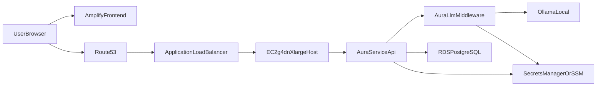

# Aura Ecosystem Analysis And AWS Integration Plan

## Confirmed Current Plan
- Frontend repository is [E:/wakandainnovations/aura-radix](E:/wakandainnovations/aura-radix) and will be deployed on AWS Amplify.
- Backend repository is [E:/wakandainnovations/AuraService](E:/wakandainnovations/AuraService) and will run on EC2.
- Backend runtime artifact folder is [E:/wakandainnovations/aura-backend](E:/wakandainnovations/aura-backend), and this JAR is the backend process to run on EC2.
- LLM middleware repository is [E:/wakandainnovations/aura-llm](E:/wakandainnovations/aura-llm) and will run on the same EC2 host as backend.
- Ollama will run on the same EC2 host as `AuraService` and `aura-llm`.
- Chosen compute shape is **single EC2 `g4dn.xlarge`** for all three services (`AuraService`, `aura-llm`, `Ollama`).
- Database target is AWS RDS PostgreSQL.
- ECS service strategy is **strict Spot** (`FARGATE_SPOT` only).

## What The Repositories Are Doing
- [E:/wakandainnovations/AuraService](E:/wakandainnovations/AuraService) is a **Spring Boot backend API** (JWT-secured) for auth, entity management, mentions/sentiment dashboards, and AI-assisted reply/crisis/prediction endpoints.
- [E:/wakandainnovations/aura-backend](E:/wakandainnovations/aura-backend) is the **backend runtime JAR location** used to launch the backend service in your environment.
- [E:/wakandainnovations/aura-radix](E:/wakandainnovations/aura-radix) is a **Vite + React frontend** using axios with `baseURL: '/api'`, storing JWT in `localStorage` (`jwtToken`), and attaching bearer tokens in an interceptor.
- [E:/wakandainnovations/aura-llm](E:/wakandainnovations/aura-llm) is a **Java LLM middleware service** exposing `POST /api/chat` on port `1025`, and forwarding to local Ollama (`127.0.0.1:11434`).
- Core integration chain today is: frontend -> AuraService (`:8080`) -> aura-llm (`:1025`) -> Ollama (`:11434`), with AuraService persisting to PostgreSQL.

## Current Constraints Relevant To AWS
- `AuraService` still expects localhost-oriented defaults for DB and LLM URL in [E:/wakandainnovations/AuraService/src/main/resources/application.properties](E:/wakandainnovations/AuraService/src/main/resources/application.properties).
- `AuraService` secret loading depends on classpath `secrets.properties` behavior via [E:/wakandainnovations/AuraService/src/main/java/com/aura/service/config/PropertiesConfig.java](E:/wakandainnovations/AuraService/src/main/java/com/aura/service/config/PropertiesConfig.java).
- `aura-radix` is Vite-based, but env example uses `REACT_APP_*` naming and code currently relies on relative `/api`; this needs explicit production API URL strategy for Amplify.
- `AuraService` has no explicit CORS allow-list for Amplify-hosted frontend domains.
- No migration framework (Flyway/Liquibase) in `AuraService`; `ddl-auto=update` is risky for production.
- `aura-llm` currently lacks explicit health endpoint and appears to hardcode Ollama URL/model in service code, reducing runtime configurability.

## Target AWS Topology (Confirmed Direction)

## Terraform Status (Implemented)
- Infrastructure code has been split into service-focused Terraform files under [E:/wakandainnovations/AuraService/terraform](E:/wakandainnovations/AuraService/terraform):
  - `versions.tf`, `provider.tf`, `variables.tf`, `locals.tf`
  - `network.tf`, `security.tf`, `iam.tf`
  - `ec2.tf`, `rds.tf`, `ecs.tf`, `outputs.tf`
- ECS service is configured with `assign_public_ip = true` and strict Spot capacity provider in [E:/wakandainnovations/AuraService/terraform/ecs.tf](E:/wakandainnovations/AuraService/terraform/ecs.tf).
- EC2 configuration includes `g4dn.xlarge`, latest Deep Learning AMI discovery, 100GB `gp3` root volume, and `instance_initiated_shutdown_behavior = "terminate"` in [E:/wakandainnovations/AuraService/terraform/ec2.tf](E:/wakandainnovations/AuraService/terraform/ec2.tf).
- RDS PostgreSQL (`db.t3.small`) is provisioned in private subnets with SG-restricted access in [E:/wakandainnovations/AuraService/terraform/rds.tf](E:/wakandainnovations/AuraService/terraform/rds.tf).

## Documentation Artifacts (CSV)
- Full infrastructure inventory: [E:/wakandainnovations/AuraService/terraform/aws_infrastructure_inventory.csv](E:/wakandainnovations/AuraService/terraform/aws_infrastructure_inventory.csv)
- Application-to-infrastructure mapping: [E:/wakandainnovations/AuraService/terraform/application_infra_mapping.csv](E:/wakandainnovations/AuraService/terraform/application_infra_mapping.csv)
- Security group rule matrix: [E:/wakandainnovations/AuraService/terraform/security_group_rule_matrix.csv](E:/wakandainnovations/AuraService/terraform/security_group_rule_matrix.csv)
- Least-privilege recommendations backlog: [E:/wakandainnovations/AuraService/terraform/least_privilege_recommendations.csv](E:/wakandainnovations/AuraService/terraform/least_privilege_recommendations.csv)

## Implementation Plan
1. **Unify runtime contract across three repos**
   - Document concrete URL/port contract: `AmplifyFrontend -> AuraService -> aura-llm -> Ollama`.
   - Set stable internal endpoint for middleware on same EC2 (prefer loopback URL from `AuraService` env).
2. **Frontend production wiring (`aura-radix`)**
   - Migrate API URL strategy from dev proxy-only `/api` to Vite runtime env (`VITE_API_BASE_URL`) for Amplify.
   - Keep auth flow (JWT bearer token) unless you explicitly decide to adopt Cognito later.
3. **AuraService production hardening**
   - Add prod profile and env-driven config for DB, JWT secret, CORS origins, and middleware URL.
   - Replace classpath secret file dependency with env/secret-store retrieval.
   - Disable unsafe startup behaviors in prod (sample user/data seeding, debug-heavy logs).
4. **aura-llm hardening for EC2**
   - Externalize Ollama URL/model to true property-driven behavior.
   - Add a lightweight health endpoint (or actuator health) for process supervision.
5. **RDS migration path**
   - Introduce Flyway and baseline schema from current PostgreSQL shape.
   - Set production schema mode to `validate`/`none`, then cut over JDBC to RDS endpoint.
6. **Single-EC2 process model**
   - Run backend JAR from `aura-backend`, `aura-llm`, and Ollama as separate services on one EC2 `g4dn.xlarge` instance.
   - Expose only AuraService publicly through ALB/HTTPS; keep middleware and Ollama bound to localhost.
   - Reserve headroom for GPU and RAM contention from Ollama inference; define JVM memory caps for both Java services.
7. **Amplify deployment**
   - Configure Amplify build from `aura-radix` and set env vars (`VITE_API_BASE_URL`, auth-related keys as needed).
   - Add route/rewrite rules only if you keep relative `/api` behavior.
8. **Observability and reliability**
   - Centralize logs to CloudWatch, add alarms for app errors/latency and RDS metrics.
   - Add backup/restore policy and startup dependency ordering (`Ollama -> aura-llm -> AuraService`).
9. **Harden strict Spot operations**
   - Add interruption-aware handling for Spot-only ECS workloads (graceful shutdown, retry posture, and idempotent startup).
   - Decide whether to keep `desired_count = 1` for cost, or raise Spot task count for better continuity.

## Validation Checklist
- Amplify-hosted frontend can login and call protected AuraService APIs with no CORS failures.
- AuraService can reach aura-llm over localhost/internal URL on EC2.
- aura-llm can reach Ollama locally and return responses through AuraService endpoints.
- AuraService connects to RDS successfully with prod profile and no local DB dependency.
- JWT issuance/verification uses secrets from AWS secret store (not classpath secret files).
- Flyway migrations run cleanly and schema drift is controlled in production.
- Only AuraService is internet-accessible; aura-llm and Ollama remain private to host/network.
- End-to-end latency remains acceptable on single-host `g4dn.xlarge` under expected concurrent load.
- Strict Spot interruptions are handled acceptably for the chosen service SLOs.
